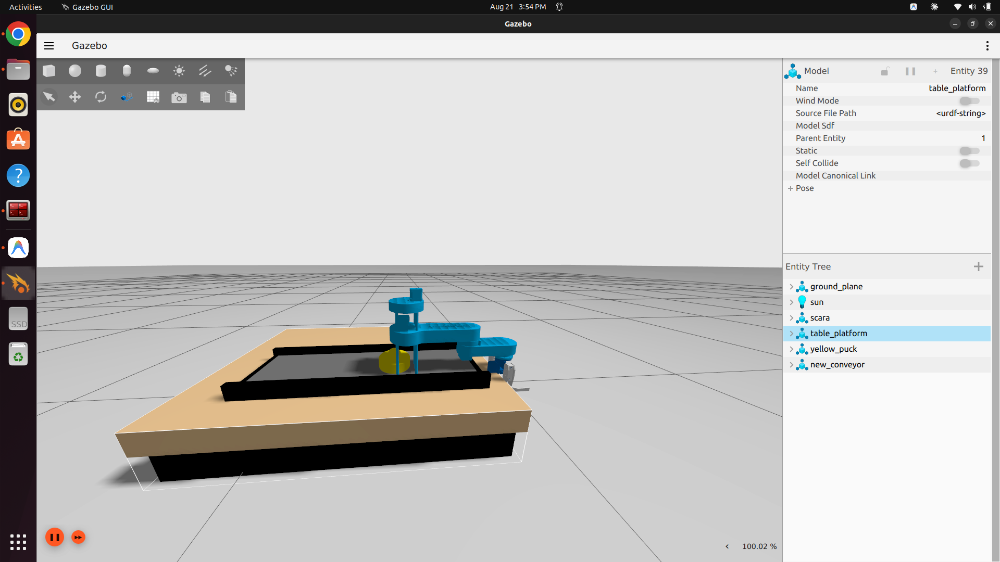
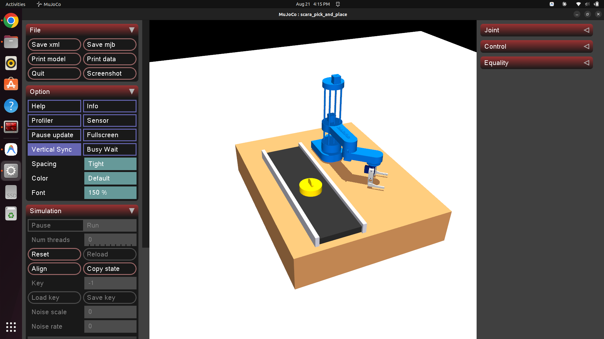

# SCARA Robot Simulation Workspace (ROS 2 Humble & MuJoCo)

A comprehensive ROS 2 Humble workspace featuring a **4-DOF SCARA Robot** mounted on a wooden workspace table platform, complete with a **conveyor belt system**, **yellow puck payload object**, **automated pick-and-place state machine**, and dual simulation engine support (**Gazebo Ignition Fortress** and **MuJoCo 3.12**).

---

## 📸 Simulation Screenshots & Demo Video

### 📹 Demonstration Video
https://github.com/user-attachments/assets/scara_demo.webm

*(Demo video file stored at [`docs/media/scara_demo.webm`](docs/media/scara_demo.webm))*

<video src="docs/media/scara_demo.webm" controls="controls" width="100%" style="max-width:800px;"></video>

---

### 🖼️ Gazebo Ignition Fortress Simulation


---

### 🖼️ MuJoCo 3.12 Simulation


---

## 🌟 Key Features

- 🦾 **4-DOF SCARA Robot Model**: Full kinematic chain including `column_joint`, `shoulder_joint` (prismatic Z-axis), `forearm_joint`, `wrist_joint`, and dual-finger parallel gripper.
- 🪵 **Workspace Table Platform**: Rigid base platform (`table_link`) supporting tabletop mounting for the robot and conveyor track.
- 📦 **Conveyor Belt System**: Transport conveyor belt track model with metallic side guard rails.
- 🟡 **Payload Pick-and-Place**: Round yellow payload puck object with top ring handle.
- 🎮 **Dual Simulation Engines**:
  - **Gazebo Sim 6 (Ignition Fortress)**: Full `ros2_control` hardware interface with `JointTrajectoryController` and `JointStateBroadcaster`.
  - **MuJoCo 3.12**: Fast, stable physics engine backend with native 3D interactive viewer and GUI control sliders.
- 🤖 **Automated Pick-and-Place State Machine**: 10-step trajectory state machine picking the yellow puck from the conveyor track and placing it on the wooden table platform.
- 🕹️ **Teleoperation Options**: Terminal keyboard teleoperation nodes for manual joint control in both Gazebo and MuJoCo.

---

## 📂 Repository Structure

```text
scara_description_ws/
├── config/
│   └── scara_controllers.yaml    # ros2_control JointTrajectoryController configuration
├── docs/
│   └── media/                    # Screenshots & demo video
│       ├── gazebo_simulation.png
│       ├── mujoco_simulation.png
│       └── scara_demo.webm
├── launch/
│   └── gazebo.launch.py          # Gazebo Ignition simulation launch file
├── meshes/
│   ├── base_link.stl, column_link.stl, shoulder_link.stl ...  # SCARA robot 3D meshes
│   └── conveyor/                 # Conveyor belt component STL meshes
├── scripts/
│   ├── scara_teleop.py           # Terminal teleop for Gazebo simulation
│   ├── pick_and_place.py         # Automated pick-and-place state machine node
│   ├── launch_mujoco.py          # Interactive MuJoCo simulation launcher & GUI mode
│   └── scara_mujoco_teleop.py    # Terminal teleop for MuJoCo simulation
├── urdf/
│   ├── scara.urdf.xacro          # Root SCARA robot description file
│   ├── arm.xacro                 # Kinematic joints, links, table base, & ros2_control
│   ├── new_conveyor.xacro        # Transport conveyor belt track URDF model
│   ├── table_platform.xacro      # Wooden table platform URDF model
│   ├── yellow_puck.sdf           # Yellow payload puck SDF model
│   └── scara_scene_mujoco.xml    # MuJoCo MJCF full scene file
├── CMakeLists.txt
└── package.xml
```

---

## 🛠️ Prerequisites & Dependencies

### ROS 2 Packages (ROS 2 Humble)
Ensure ROS 2 Humble desktop and controller packages are installed:

```bash
sudo apt update
sudo apt install -y \
  ros-humble-ros-gz \
  ros-humble-ros-gz-sim \
  ros-humble-ros-gz-bridge \
  ros-humble-gz-ros2-control \
  ros-humble-ros2-control \
  ros-humble-ros2-controllers \
  ros-humble-xacro \
  ros-humble-robot-state-publisher
```

### Python Dependencies (for MuJoCo Backend)
Install MuJoCo 3.12 Python bindings:

```bash
python3 -m pip install mujoco
```

---

## 🚀 Installation & Building

1. Clone the repository into your workspace:
   ```bash
   git clone https://github.com/Hemanth-08-RA/Scara_robot.git ~/scara_description_ws
   ```

2. Build the workspace using `colcon`:
   ```bash
   cd ~/scara_description_ws
   source /opt/ros/humble/setup.bash
   colcon build
   ```

3. Source the workspace environment overlay:
   ```bash
   source ~/scara_description_ws/install/setup.bash
   ```

---

## 🎯 Usage

### 1. Gazebo Ignition Simulation

#### Launch Gazebo Sim & Robot Workspace:
```bash
cd ~/scara_description_ws
source /opt/ros/humble/setup.bash
source install/setup.bash
ros2 launch scara_description gazebo.launch.py
```

#### Run Automated Pick and Place Routine:
In a separate terminal:
```bash
cd ~/scara_description_ws
source /opt/ros/humble/setup.bash
source install/setup.bash
ros2 run scara_description pick_and_place.py
```

#### Run Terminal Teleoperation (Gazebo):
```bash
cd ~/scara_description_ws
source /opt/ros/humble/setup.bash
source install/setup.bash
ros2 run scara_description scara_teleop.py
```

---

### 2. MuJoCo Simulation Backend

#### Interactive GUI Control Mode (Sliders):
Launch the native interactive 3D MuJoCo viewer:
```bash
cd ~/scara_description_ws
source /opt/ros/humble/setup.bash
source install/setup.bash
ros2 run scara_description launch_mujoco.py
```
*Expand the **Control** tab on the top-right sidebar to drag joint position sliders manually.*

#### Automated Pick and Place (MuJoCo):
```bash
ros2 run scara_description launch_mujoco.py --auto
```

#### Terminal Teleoperation (MuJoCo):
```bash
cd ~/scara_description_ws
source /opt/ros/humble/setup.bash
source install/setup.bash
ros2 run scara_description scara_mujoco_teleop.py
```

---

## 📜 License

This repository is licensed under the Apache 2.0 License.
